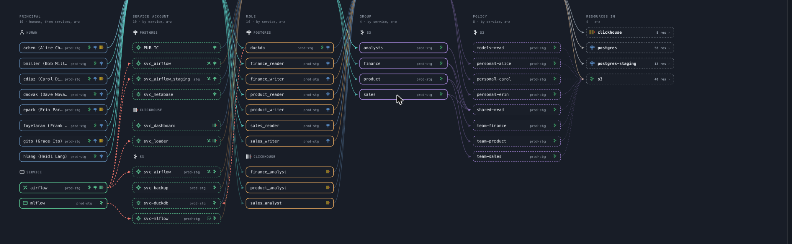

# Grantline

[English](../README.md) · [한국어](README.ko.md) · [日本語](README.ja.md) · [简体中文](README.zh-CN.md)

**複雑な権限をほどき、付与経路をたどる。**

**PostgreSQL、ClickHouse、S3 互換ストレージ**の権限を可視化・管理する
オープンソースのダッシュボードです。SeaweedFS にも対応しています。
ロールベースのアクセス制御（RBAC）を可視化し、ロール・グループ・IAM ポリシーを
通じたアクセス経路を追跡し、実際の権限と宣言との差分を変更前に確認できます。
権限の適用は各サービスが担当します。



## ローカルで試す

Python 3.11 以降と [uv](https://docs.astral.sh/uv/) が必要です。
デモには別のサーバーや認証情報は不要です。

```bash
git clone https://github.com/msk-psp/grantline-public.git
cd grantline-public
uv venv
uv pip install -e .
source .venv/bin/activate
grantline -c examples/demo/grantline.toml serve
```

**http://127.0.0.1:8420/** を開いてください。最初の画面はアクセス経路マップです。
**サービス**はサービス別のリソース一覧、**権限表**は権限の比較、
**変更**は権限付与・取り消しのプレビューを表示します。
アカウントを選択すると、その権限とアクセス経路を確認できます。

画面は **英語・韓国語・日本語・簡体字中国語**に対応しています。
各ページ上部で選んだ言語は Cookie に保存されます。
初回アクセス時はブラウザーの言語を使います。
アカウント名、リソースのパス、サービスのネイティブコマンドは元の表記を維持します。

## Dockerで実行する

GitHub Releaseの公開時に、GHCRへ`linux/amd64`・`linux/arm64`イメージを配布します。
安定版は`latest`も更新します。プレリリースには個別のバージョンタグを使います。

```bash
docker run --rm -p 127.0.0.1:8420:8420 ghcr.io/msk-psp/grantline-public:latest
```

**http://127.0.0.1:8420/** で、認証情報なしで内蔵デモを試せます。
実際のシステムでは外部設定をマウントし、実行記録を永続化してください。
[コンテナ設定](usage.md#containers)を参照し、デプロイにはリリースタグまたは
digestを固定してください。PostgreSQLドライバーはイメージに含まれています。

## よく使うコマンド

```bash
grantline -c examples/demo/grantline.toml plan      # 権限の差分とネイティブコマンドを確認
grantline -c examples/demo/grantline.toml apply     # ドライランのみ、変更なし
grantline -c examples/demo/grantline.toml history  # 記録済みの観測結果を比較
```

`apply --write` は設定されたシステムを変更し、デモのデータファイルも変更します。
有効にする前にプレビューと管理範囲を確認してください。

## システムを接続する

実際の設定は `~/.config/grantline/prod.toml` など、リポジトリの外に保存してください。
設定には認証情報を保持する環境変数の名前を指定します。
観測用と書き込み用の認証情報は分離されています。PostgreSQL を使う場合は
`uv pip install 'grantline[postgres]'` で追加の依存関係をインストールします。

以下の詳細ドキュメントは英語です。

- [設定と運用](usage.md): アダプター、認証情報、ブリッジ、権限宣言、アクセス確認、観測記録、承認。
- [セキュリティ](../SECURITY.md): コンソールの共有と書き込みの有効化。内蔵サーバーはユーザーを認証しないため、共有環境には認証プロキシが必要です。
- [コントリビューション](../CONTRIBUTING.md): 開発環境とチェック。
- [製品範囲](prd/003-scope.md): 要件と実装状況。

読み取れない範囲は **不明**であり、「アクセス権限なし」とは扱いません。
書き込みの前には必ずネイティブ操作をプレビューし、実行の試行と結果を監査記録に残します。
宣言に基づく取り消しは、管理対象のアカウントと宣言が記述するシステムに限定されます。

## ライセンス

[Apache-2.0](../LICENSE)。
